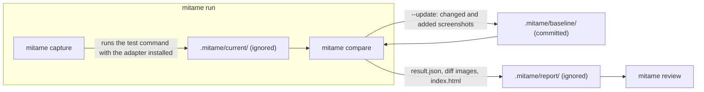

# mitame

mitame (見た目, pronounced /mitame/, roughly "mee-tah-meh") is the Japanese word for how something looks.

Visual regression testing for Flutter, Android, and iOS with one binary and one report. A single Rust binary compares screenshots against a committed baseline, produces diff images and a machine-readable result, and updates the baseline from the result. Thin per-platform capture adapters, each a few hundred lines that depend on the platform SDK alone, write PNG files into a fixed layout and nothing else.

## Why mitame

Flutter already has golden tests, and Android and iOS have mature snapshot libraries. mitame exists because of what those leave unsolved.

- **Upgrades stop invalidating every golden.** `flutter_test` compares pixels exactly, so an engine or SDK update that shifts a few pixels of anti-aliasing fails every golden at once, and the only remedies are to regenerate them all without knowing whether a real change slipped in, or to render text as Ahem boxes on CI and never check real text. mitame's per-pixel tolerance and anti-aliasing detection separate that noise from change (in one measured Flutter app, 24 goldens went from 8 to 9 differing pixels each under stock to 0 under mitame), while every remaining pixel counts, so a one-word change is never hidden. Systematic differences between rendering platforms, such as macOS against Linux, are not absorbed; they get a baseline per profile instead.
- **Review instead of assert.** A visual difference does not fail the test run. `mitame compare` reports every changed screenshot with a diff image in a self-contained HTML page, and `--update` writes the changed and added ones into the baseline, where git shows the change and lets you revert what you do not want. Baselines live under `.mitame/baseline/` as one reviewable set rather than scattered next to tests. This is the workflow of hosted tools like Percy or reg-suit, without a hosted service and without a Node toolchain in a mobile repository.
- **One pipeline for Flutter, Android, and iOS.** The adapters share a file contract, so the same tolerance, anti-aliasing detection, profiles, approval flow, and report page apply to all three. The Android and iOS adapters were added without changing the binary, and a single `compare` run reports every platform on one page.
- **Dependencies that do not rot.** Golden helper packages pull in their own dependency trees and break, or are discontinued, when the SDK moves. Each mitame adapter depends only on its platform's SDK (`flutter_test`, the Android SDK, UIKit), so the only thing it tracks is that SDK, and the comparison logic lives in a static binary with no relationship to your lockfiles.
- **Comparison outside the test process.** The test isolate only encodes and writes a PNG; decoding, diffing, and reporting happen once per suite in Rust, in parallel, and never block a test file. Unchanged goldens cost the same as stock; when every golden differs, the comparison overhead for 200 phone-size goldens drops from 2.9 s to 0.7 s, and from 18.8 s to 3.8 s at 3x device size (`mitame-bench`, 4 jobs, Apple Silicon). Rendering and PNG encoding inside the test runner are unchanged and remain the larger share of total time.

### Who it is for

Flutter teams first: the golden churn on SDK upgrades is the problem mitame was built against. The Android and iOS adapters serve two other cases. One is a company whose Flutter, iOS, and Android apps live in separate repositories and want the same binary, the same `mitame.toml`, the same report, and the same CI shape in each of them. The other is a single native codebase that wants the review-style flow (tolerance and anti-aliasing detection, an HTML report, a baseline updated through git) with an adapter that depends on the platform SDK alone. If you rely on Roborazzi's Compose Preview integration or on swift-snapshot-testing's non-image strategies, keep them: mitame's adapters render a view to a bitmap and stop.

## Status

Early development, no release cut yet. The end-to-end flow (`mitame run` around the test command, `mitame compare` with an HTML report, `--update` into the baseline) works for the Flutter, Android, and iOS example projects in this repository. The adapters are not yet published as packages. See the [roadmap](docs/roadmap.md).

## Install

Prebuilt binaries are on [GitHub Releases](https://github.com/mataku/mitame/releases) for macOS (arm64, x64), Linux (x64, arm64, statically linked with musl), and Windows (x64). Archives are named `mitame-<target>.tar.gz` with `<target>` one of `aarch64-apple-darwin`, `x86_64-apple-darwin`, `x86_64-unknown-linux-musl`, `aarch64-unknown-linux-musl`, `x86_64-pc-windows-msvc`, each with a `.sha256` file:

```sh
curl -fsSL https://github.com/mataku/mitame/releases/latest/download/mitame-aarch64-apple-darwin.tar.gz | tar xz
sudo mv mitame-aarch64-apple-darwin/mitame /usr/local/bin/
```

Building from source works as well:

```sh
cargo install --git https://github.com/mataku/mitame --tag v0.1.0 mitame-cli
```

Windows is experimental: the archive is built in the release matrix, but nothing in CI runs it, and `mitame capture` and `mitame run` start the test command without a shell, so a launcher such as `gradlew.bat` must be named with its extension, and a `flutter` command needs `--flutter flutter.bat` or `MITAME_FLUTTER`.

On GitHub Actions, the same `curl` step installs the Linux archive in a few seconds. See [CI](docs/ci.md).

Adapters:

- Flutter: [`mitame_flutter`](https://pub.dev/packages/mitame_flutter) on pub.dev: `flutter pub add --dev mitame_flutter`.
- Android: `io.github.mataku:mitame-android` and `io.github.mataku:mitame-android-compose` on Maven Central, TBA.
- iOS: a Swift package exposed through the repository's root `Package.swift`.

  ```swift
  .package(url: "https://github.com/mataku/mitame", from: "0.1.0")
  ```

## Quick start (Flutter)

Add the adapter with `flutter pub add --dev mitame_flutter`, then replace the comparator in `test/flutter_test_config.dart`:

```dart
import 'dart:async';
import 'package:mitame_flutter/mitame_flutter.dart';

Future<void> testExecutable(FutureOr<void> Function() testMain) async {
  await Mitame.install(loadFonts: true);
  await testMain();
}
```

Existing `matchesGoldenFile` calls now capture instead of compare. To capture variants, encode them in the golden name:

```dart
for (final variant in Mitame.matrix({'theme': ['light', 'dark'], 'locale': ['ja', 'en']})) {
  await tester.pumpWidget(buildApp(variant));
  await tester.pumpAndSettle();
  await expectLater(find.byType(LoginForm), matchesGoldenFile(Mitame.golden('login_form', variant)));
}
```

Run, review, update:

```sh
mitame init             # writes mitame.toml with [capture] command = ["flutter", "test"]
mitame run              # capture, then compare; exit 0 clean, 1 differences, 2 error
mitame review           # open the report in the browser; `mitame review <id>` jumps to one screenshot
mitame compare --update # write the changed and added screenshots into .mitame/baseline/, then review the git diff
```

The commands map onto three directories. `run` is `capture` followed by `compare`; only `baseline/` is committed.



Add `.mitame/current/` and `.mitame/report/` to `.gitignore` and commit `.mitame/baseline/`. `mitame init` writes `mitame.toml` with the detected test command and the default settings; the command can also be given after `--`, as in `mitame run -- flutter test`. Existing goldens can be moved into the baseline by copying: the adapter writes exactly the bytes stock `flutter_test` would have written, and `flutter test --update-goldens` also writes into `.mitame/current/` once the adapter is installed.

## Examples

Each adapter ships a small project that shows the complete setup for that platform, with a committed baseline and a README listing exactly which files to copy:

- [`adapters/flutter/example`](adapters/flutter/example/README.md): a Flutter package with `flutter_test_config.dart`, variant goldens through `Mitame.matrix`, and an unmodified `matchesGoldenFile` test.
- [`adapters/android/example`](adapters/android/example/README.md): a Gradle module with Robolectric tests capturing a `View` and a Compose screen, including the `MITAME_OUTPUT_DIR` handling a Gradle module needs.
- [`adapters/ios/Tests/MitameExampleTests`](adapters/ios/Tests/MitameExampleTests/README.md): an XCTest target capturing UIKit and SwiftUI views, run through `mitame run` so the `TEST_RUNNER_` environment prefix is handled.

## Documentation

- [How it fits together](docs/concepts.md): layout, identities, profiles, `mitame run`, and the report
- [Flutter](docs/flutter.md), [Android](docs/android.md), [iOS](docs/ios.md): adapter details per platform
- [Configuration](docs/configuration.md): `mitame.toml`, thresholds, and rules
- [CI](docs/ci.md): baselines per rendering platform and the GitHub Actions workflow
- [Roadmap](docs/roadmap.md) and [Releasing](docs/releasing.md)

## License

MIT. See [LICENSE](LICENSE).
