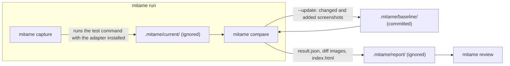

# mitame

[](https://github.com/mataku/mitame/actions/workflows/ci.yml) [](https://github.com/mataku/mitame/releases) [](https://pub.dev/packages/mitame_flutter) [](https://central.sonatype.com/artifact/io.github.mataku/mitame-android) [](LICENSE)

mitame (見た目, pronounced /mitame/, roughly "mee-tah-meh") is the Japanese word for how something looks.

Visual regression testing for Flutter, Android, and iOS with one binary and one report. A single Rust binary compares screenshots against a committed baseline, produces diff images and a machine-readable result, and updates the baseline from the result. Thin per-platform capture adapters, each a few hundred lines that depend on the platform SDK alone, write PNG files into a fixed layout and nothing else.

## Why mitame

Flutter already has golden tests, and Android and iOS have mature snapshot libraries. mitame exists because of what those leave unsolved.

- **Upgrades stop invalidating every golden.** Per-pixel tolerance and anti-aliasing detection absorb the few-pixel shifts an SDK update causes, while every remaining pixel still counts, so a one-word change is never hidden.
- **Review instead of assert.** A visual difference does not fail the test run. The report shows it next to a diff image, and `--update` writes it into a baseline that git reviews and reverts.
- **One pipeline for Flutter, Android, and iOS.** The adapters share a file contract, so one binary, one `mitame.toml`, and one report serve all three.
- **Dependencies that do not rot.** Each adapter depends only on its platform SDK (`flutter_test`, the Android SDK, UIKit); the comparison lives in a static binary outside your lockfiles.
- **Comparison outside the test process.** Tests only write PNGs; decoding, diffing, and reporting run once per suite in Rust, in parallel. Unchanged goldens cost the same as stock and changed ones a fraction; see [`bench/README.md`](bench/README.md) for numbers.

### Who it is for

Flutter teams first: the golden churn on SDK upgrades is the problem mitame was built against. The Android and iOS adapters serve two other cases. One is a company whose Flutter, iOS, and Android apps live in separate repositories and want the same binary, the same `mitame.toml`, the same report, and the same CI shape in each of them. The other is a single native codebase that wants the review-style flow (tolerance and anti-aliasing detection, an HTML report, a baseline updated through git) with an adapter that depends on the platform SDK alone. If you rely on Roborazzi's Compose Preview integration or on swift-snapshot-testing's non-image strategies, keep them: mitame's adapters render a view to a bitmap and stop.

## Status

0.1.0 is the first release. The end-to-end flow (`mitame run` around the test command, `mitame compare` with an HTML report, `--update` into the baseline) works for the Flutter, Android, and iOS example projects in this repository. The adapters are not yet published as packages. See the [roadmap](docs/roadmap.md).

## Install

With Homebrew on macOS or Linux:

```sh
brew install mataku/tap/mitame
```

Prebuilt binaries are on [GitHub Releases](https://github.com/mataku/mitame/releases) for macOS (arm64, x64), Linux (x64, arm64, statically linked with musl), and Windows (x64). Archives are named `mitame-<target>.tar.gz` with `<target>` one of `aarch64-apple-darwin`, `x86_64-apple-darwin`, `x86_64-unknown-linux-musl`, `aarch64-unknown-linux-musl`, `x86_64-pc-windows-msvc`, each with a `.sha256` file:

```sh
curl -fsSL https://github.com/mataku/mitame/releases/latest/download/mitame-aarch64-apple-darwin.tar.gz | tar xz
sudo mv mitame-aarch64-apple-darwin/mitame /usr/local/bin/
```

Building from source works as well:

```sh
cargo install --git https://github.com/mataku/mitame --tag v0.1.0 mitame-cli
```

Windows is experimental: the archive is built in the release matrix, but nothing in CI runs it, and `mitame capture` and `mitame run` start the test command without a shell, so a launcher such as `gradlew.bat` must be named with its extension, and a `flutter` command needs `--flutter flutter.bat` or `MITAME_FLUTTER`.

On GitHub Actions, the same `curl` step installs the Linux archive in a few seconds. See [CI](docs/ci.md).

Adapters:

- Flutter: [`mitame_flutter`](https://pub.dev/packages/mitame_flutter) on pub.dev: `flutter pub add --dev mitame_flutter`.
- Android: [`io.github.mataku:mitame-android`](https://central.sonatype.com/artifact/io.github.mataku/mitame-android) and [`io.github.mataku:mitame-android-compose`](https://central.sonatype.com/artifact/io.github.mataku/mitame-android-compose) on Maven Central: `testImplementation("io.github.mataku:mitame-android:0.1.0")`.
- iOS: a Swift package exposed through the repository's root `Package.swift`.

  ```swift
  .package(url: "https://github.com/mataku/mitame", from: "0.1.0")
  ```

## Quick start

Install the binary, then in the repository:

```sh
mitame init             # writes mitame.toml with the detected test command (flutter test, ./gradlew test --rerun)
mitame run              # capture, then compare; exit 0 clean, 1 differences, 2 error
mitame review           # open the report in the browser; `mitame review <id>` jumps to one screenshot
mitame compare --update # write the changed and added screenshots into .mitame/baseline/, then review the git diff
```

Add `.mitame/current/` and `.mitame/report/` to `.gitignore` and commit `.mitame/baseline/`. The commands map onto three directories. `run` is `capture` followed by `compare`; only `baseline/` is committed.



Capture is the adapter's job; add the one for your platform.

### Flutter

`flutter pub add --dev mitame_flutter`, then replace the comparator in `test/flutter_test_config.dart`:

```dart
import 'dart:async';
import 'package:mitame_flutter/mitame_flutter.dart';

Future<void> testExecutable(FutureOr<void> Function() testMain) async {
  await Mitame.install(loadFonts: true);
  await testMain();
}
```

Existing `matchesGoldenFile` calls now capture instead of compare, and existing goldens move into the baseline by copying. `mitame init` sets `fonts = "ahem"`, which renders text as boxes so one baseline serves macOS and Linux CI; set `fonts = "real"` to check real glyphs with a baseline per platform (see [CI](docs/ci.md)). To capture variants, encode them in the golden name:

```dart
for (final variant in Mitame.matrix({'theme': ['light', 'dark'], 'locale': ['ja', 'en']})) {
  await tester.pumpWidget(buildApp(variant));
  await tester.pumpAndSettle();
  await expectLater(find.byType(LoginForm), matchesGoldenFile(Mitame.golden('login_form', variant)));
}
```

### Android

Add `testImplementation("io.github.mataku:mitame-android-compose:0.1.0")` (it brings `mitame-android`, which is enough on its own for `View` capture), then capture from a Robolectric test:

```kotlin
@RunWith(RobolectricTestRunner::class)
@GraphicsMode(GraphicsMode.Mode.NATIVE)
class LoginFormTest {
    @get:Rule
    val composeTestRule = createComposeRule()

    @Test
    fun loginForm() {
        composeTestRule.setContent { LoginForm(dark = false) }
        composeTestRule.captureMitame("login_form", mapOf("theme" to "light"))
    }
}
```

A `View` goes through `Mitame.capture(view, "login_form", variant, widthPx = 1080, heightPx = 720)`. Robolectric renders the same pixels on macOS and Linux, so the baseline needs no per-platform profile. Point `[capture] command` in `mitame.toml` at the module's test task with `--rerun`, and see [Android](docs/android.md) for the `MITAME_OUTPUT_DIR` handling a Gradle module needs.

### iOS

Add `.package(url: "https://github.com/mataku/mitame", from: "0.1.0")` to the test target, then capture from an XCTest:

```swift
@MainActor
final class LoginFormTests: XCTestCase {
    func testLoginForm() throws {
        try Mitame.capture(LoginForm(dark: false), name: "login_form", variant: ["theme": "light"])
    }
}
```

A SwiftUI `View` is sized by `sizeThatFits` at 390 points wide unless `size:` is given; a `UIView` goes through the same call. Set `[capture] command` to your `xcodebuild test` invocation, including a `-destination` with `OS=`; `mitame run` passes the `TEST_RUNNER_` variables xcodebuild needs. See [iOS](docs/ios.md).

## Examples

Each adapter ships a small project that shows the complete setup for that platform, with a committed baseline and a README listing exactly which files to copy:

- [`adapters/flutter/example`](adapters/flutter/example/README.md): a Flutter package with `flutter_test_config.dart`, variant goldens through `Mitame.matrix`, and an unmodified `matchesGoldenFile` test.
- [`adapters/android/example`](adapters/android/example/README.md): a Gradle module with Robolectric tests capturing a `View` and a Compose screen, including the `MITAME_OUTPUT_DIR` handling a Gradle module needs.
- [`adapters/ios/Tests/MitameExampleTests`](adapters/ios/Tests/MitameExampleTests/README.md): an XCTest target capturing UIKit and SwiftUI views, run through `mitame run` so the `TEST_RUNNER_` environment prefix is handled.

## Documentation

- [How it fits together](docs/concepts.md): layout, identities, profiles, `mitame run`, and the report
- [Flutter](docs/flutter.md), [Android](docs/android.md), [iOS](docs/ios.md): adapter details per platform
- [Configuration](docs/configuration.md): `mitame.toml`, thresholds, and rules
- [CI](docs/ci.md): baselines per rendering platform and the GitHub Actions workflow
- [Roadmap](docs/roadmap.md) and [Releasing](docs/releasing.md)
- [Agent skills](skills/): `mitame-setup` walks a coding agent through adopting mitame in a project, and `mitame-review` through running it and updating the baseline; install both with `npx skills add mataku/mitame`, or copy the directories into your agent's skills folder

## License

MIT. See [LICENSE](LICENSE).
